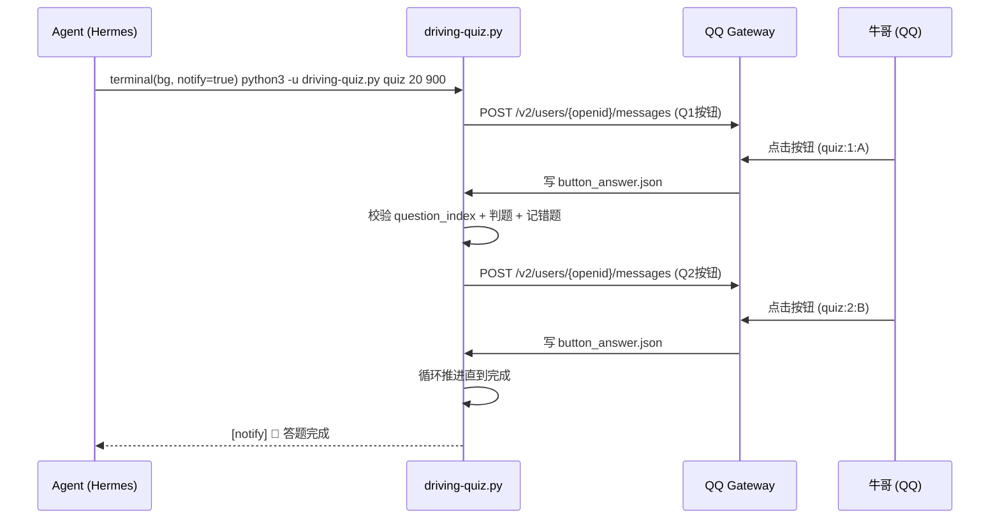

# QQ Bot 答题门禁 — 按钮系统

## 架构总览

```
┌─────────────────────────────────────────────────────────────┐
│                       QQ Bot 按钮答题流程                       │
├─────────────────────────────────────────────────────────────┤
│                                                             │
│  Agent (driving-quiz.py)          QQ Bot Gateway             │
│  ┌─────────────────────┐    ┌─────────────────────────┐     │
│  │ cmd_start(N)        │    │ adapter.py              │     │
│  │  ├── 创建会话        │    │  ├── _handle_interaction│     │
│  │  └── cmd_send() ────┼───▶│  ├── parse_quiz_button  │     │
│  │                      │    │  │  ├─ answer mode      │     │
│  │ cmd_poll()          │    │  │  ├─ toggle mode       │     │
│  │  ├── check_button()◀─┼────│  │  └─ submit mode      │     │
│  │  └── 返回答案        │    │  └── button_answer.json │     │
│  │                      │    └─────────────────────────┘     │
│  │ cmd_answer(X)        │    ┌─────────────────────────┐     │
│  │  ├── 检查答案         │    │  用户(QQ客户端)          │     │
│  │  ├── 推进下一题       │    │  ┌─────────────────┐    │     │
│  │  └── cmd_send() ────┼───▶│  │ 点击按钮 → 回调  │    │     │
│  └─────────────────────┘    │  └─────────────────┘    │     │
│                              └─────────────────────────┘     │
└─────────────────────────────────────────────────────────────┘
```

## 按钮数据格式

三种回调模式，由 gateway 的 `keyboards.py` 中 `_QUIZ_DATA_RE` 正则解析：

```python
_QUIZ_DATA_RE = re.compile(
    r"^quiz:(?:(\d+):([A-D,]+)|toggle_(\d+):([A-D])|submit_(\d+))$"
)
```

| 模式 | 按钮 data 示例 | 含义 |
|------|---------------|------|
| **answer** (单选/判断) | `quiz:1:A` | 第1题，选A — 直接提交答案 |
| **toggle** (多选切换) | `quiz:toggle_1:A` | 第1题，切换A的选中状态 |
| **submit** (多选提交) | `quiz:submit_1` | 第1题，合并已选项并提交 |

### 按钮发送（driving-quiz.py 侧）

```python
# 单选题键盘：2行×2列，点击即提交
def _build_single_choice_keyboard(question_index, titles, items=None):
    rows = []
    for i in range(0, len(titles), 2):
        buttons = []
        for letter in titles[i:i+2]:
            data = "quiz:%d:%s" % (question_index + 1, letter)
            buttons.append({
                "id": "q_%d_%s" % (question_index, letter),
                "render_data": {"label": letter, "visited_label": "✓ %s" % letter, "style": 1},
                "action": {"type": 1, "data": data, "unsupport_tips": "请回复答案字母"},
            })
        rows.append({"buttons": buttons})
    return {"content": {"rows": rows}}

# 多选题键盘：点选切换⬜/✅，最后点「📋 提交答案」
def _build_multi_choice_keyboard(question_index, titles, items=None):
    rows = []
    for i in range(0, len(titles), 2):
        buttons = []
        for letter in titles[i:i+2]:
            data = "quiz:toggle_%d:%s" % (question_index + 1, letter)
            buttons.append({
                ...
                "render_data": {"label": "⬜ %s" % letter, "visited_label": "✅ %s" % letter, ...},
                "action": {"type": 1, "data": data, ...},
            })
        rows.append({"buttons": buttons})
    # 提交按钮
    submit_data = "quiz:submit_%d" % (question_index + 1)
    rows.append({"buttons": [{
        "render_data": {"label": "📋 提交答案", ...},
        "action": {"type": 1, "data": submit_data, ...},
    }]})

# 判断题键盘：[A 正确] [B 错误] 一行两列
def _build_judge_keyboard(question_index):
    # 两个按钮：quiz:N:A 和 quiz:N:B
    pass
```

## 按钮回调处理（Gateway 侧）

文件：`/usr/local/lib/hermes-agent/gateway/platforms/qqbot/adapter.py`（约 line 1180-1256）

函数 `_default_interaction_dispatch` → `parse_quiz_button_data`:

1. **answer 模式**（单选/判断）：`quiz:N:LETTER`
   - 直接写 `~/.hermes/scripts/driving-quiz/button_answer.json`
   ```json
   {"question_index": N, "answer": "A", "mode": "answer", "timestamp": ...}
   ```

2. **toggle 模式**（多选点选）：`quiz:toggle_N:LETTER`
   - 维护 `multi_select_N.json` 数组文件，点选切换
   ```json
   ["A", "B"]  // 或 ["C"] 或 []
   ```

3. **submit 模式**（多选提交）：`quiz:submit_N`
   - 读取 `multi_select_N.json`，合并为逗号字符串
   - 写入 `button_answer.json`
   ```json
   {"question_index": N, "answer": "A,B", "mode": "submit", "timestamp": ...}
   ```
   - 清理 `multi_select_N.json`

## Agent 端轮询（driving-quiz.py 侧）

`cmd_poll(timeout=600)` 函数：
- 每 1.5 秒检查一次 `button_answer.json`
- 验证 `question_index` 是否匹配当前题目（防过期）
- 找到有效答案后删除文件，输出 `ANSWER:A`
- 超时返回 `TIMEOUT`

```python
def cmd_poll(timeout=600):
    '''轮询按钮答案，直到用户点击按钮或超时。'''
    deadline = time.time() + timeout
    while time.time() < deadline:
        result = _check_button_answer_file()
        if result is not None:
            print(result)
            return result
        time.sleep(1.5)
    print("TIMEOUT")
```

## 自动接续模式

`cmd_start()` 现在直接转发到 `cmd_quiz()`；生产入口不再依赖手动 `poll`。

所以单次测验的推荐流程是：

```
python3 driving-quiz.py quiz 5 600    → 创建会话 + 发Q1 + 进程内自动等答案
```

`cmd_quiz()` 在同一个进程里完成：发题 → 等按钮答案 → 判题/记错 → 自动发下一题 → 直到完成。

## 关键文件位置

| 组件 | 路径 |
|------|------|
| 驾考脚本 | `~/.hermes/scripts/driving-quiz.py` |
| 按钮答案文件 | `~/.hermes/scripts/driving-quiz/button_answer.json` |
| 多选状态文件 | `~/.hermes/scripts/driving-quiz/multi_select_N.json` |
| 按钮构建函数 | `_build_single_choice_keyboard` / `_build_multi_choice_keyboard` / `_build_judge_keyboard` |
| Gateway 回调适配 | `/usr/local/lib/hermes-agent/gateway/platforms/qqbot/adapter.py#L1180-L1256` |
| 正则解析 | `/usr/local/lib/hermes-agent/gateway/platforms/qqbot/keyboards.py#L58` ( `_QUIZ_DATA_RE` ) |
| 状态持久化 | `~/.hermes/driving-test/quiz_state.json` |
| 错题本 | `~/.hermes/driving-test/wrong_questions.json` |

## 实际异步运行模式（Agent实战）

旧顺序流最大的问题是 `poll` 只处理一次答案就退出，容易出现“第一题答完后没有后续”。现在生产模式改为一个后台 `quiz` 进程跑完整场测验。

**正确的异步模式：**



**关键要点：**

1. 生产入口统一用 `python3 -u driving-quiz.py quiz N timeout`。
2. `quiz` 进程内自己等待按钮、判题、发下一题，不需要 Agent 反复重启 `poll`。
3. `poll` 和 `answer` 只保留为调试/旧流程兼容入口。
4. 若第一题后无后续，优先检查是不是某个 cron/prompt 仍在调用旧 `start + poll` 链路。
5. 超时后脚本会输出超时信息，Agent 可用 `process(action='log')` 查看完整过程。

### 故障排查

| 现象 | 原因 | 解决 |
|------|------|------|
| 第一题后没有后续 | 仍在走旧 `start + poll + answer` 链路 | 改为 `quiz N timeout` |
| 点了按钮没反应 | `quiz` 进程没在运行，或 `button_answer.json` 写入失败 | 检查后台进程和 gateway 回调日志 |
| 点了按钮显示"无权限操作" | 按钮 `action` 缺少 `permission: {"type": 2}` | 加回去 |
| 用户点了但脚本忽略 | `button_answer.json` 的 `question_index` 不匹配当前题 | 检查状态文件 `current_index` 与按钮编号 |
| 外地题混入 | 原始题库含地方题且未过滤 `regionCode` | 先过滤全国题和 `510100` 四川成都题 |
